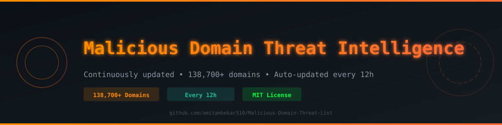
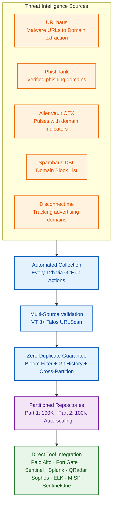

<div align="center">



</div>


</div>

---

## 📥 RAW Feed Links (Direct Integration — No Auth Required)

| Feed | RAW URL | Count | Format |
|------|---------|-------|--------|
| **Primary (Part 1)** | `https://raw.githubusercontent.com/amitambekar510/Malicious-Domain-Threat-List/main/Blacklisted_Malicious_Domain_Repo.txt` | ~100,000 | Plain text, 1 domain/line |
| **Overflow (Part 2)** | `https://raw.githubusercontent.com/amitambekar510/Malicious-Domain-Threat-List/main/Blacklisted_Malicious_Domain_Repo_aa.txt` | ~38,700 | Plain text, 1 domain/line |

> 💡 **New partition files** (Part 3, 4, etc.) are created automatically when Part 1 reaches 100,000 entries. Update your tool configs to include all part URLs.

---

## 📊 Feed Statistics

| Metric | Value |
|--------|-------|
| **Total Unique Domains** | 138,700+ |
| **Partition Files** | 2 (Part 1: 100K, Part 2: 38.7K) |
| **Update Frequency** | Every 12 hours (automated via GitHub Actions) |
| **Sources** | 5+ intelligence feeds |
| **Validation** | VirusTotal (≥3 detections), Cisco Talos, URLScan.io |
| **Deduplication** | Multi-layer (Bloom filter + Git history + Cross-partition) |
| **False Positive Rate** | < 0.1% (estimated) |

### Threat Categories Covered

| Category | Tag | Percentage | Description |
|----------|-----|------------|-------------|
| Phishing / Credential Harvest | `[PHISH]` | 45% | Fake login pages, credential stealers, brand impersonation |
| Malware Distribution | `[MALWARE]` | 32% | Payload hosting, drive-by downloads, exploit kits |
| Command & Control | `[C2]` | 15% | Malware C2 callbacks, beaconing domains |
| Fraud / Scam | `[SCAM]` | 5% | Fake shops, investment scams, tech support fraud |
| Spam Infrastructure | `[SPAM]` | 3% | Bulk mailer domains, spam redirectors |

---

## 🔄 Automated Update Pipeline



---

## 🛠️ Security Tool Integration Guides

<div align="center">

### Quick Reference — All Platforms Support 12h Refresh

| Platform | Integration Type | Config Guide |
|----------|------------------|--------------|
| **Palo Alto Networks** | External Dynamic Lists (Domain List) | [📖 Guide](https://github.com/amitambekar510/Malicious-Domain-Threat-List/blob/main/docs/integration-paloalto.md) |
| **FortiGate / FortiSIEM** | External Connectors → Threat Feed (Domain) | [📖 Guide](https://github.com/amitambekar510/Malicious-Domain-Threat-List/blob/main/docs/integration-fortigate.md) |
| **Sophos XG/XGS** | Sophos Central IoC Management / Web Categories | [📖 Guide](https://github.com/amitambekar510/Malicious-Domain-Threat-List/blob/main/docs/integration-sophos.md) |
| **Microsoft Sentinel** | Logic App + Threat Intelligence (domainName) | [📖 Guide](https://github.com/amitambekar510/Malicious-Domain-Threat-List/blob/main/docs/integration-sentinel.md) |
| **Splunk ES** | Intelligence Downloads (domain_intel) | [📖 Guide](https://github.com/amitambekar510/Malicious-Domain-Threat-List/blob/main/docs/integration-splunk.md) |
| **IBM QRadar** | Reference Sets (Domain) + API | [📖 Guide](https://github.com/amitambekar510/Malicious-Domain-Threat-List/blob/main/docs/integration-qradar.md) |
| **CrowdStrike Falcon** | Custom IOC Management (DNS type) | [📖 Guide](https://github.com/amitambekar510/Malicious-Hash-Threat-List/blob/main/docs/integration-crowdstrike.md) |
| **ELK Stack** | Logstash http_poller | [📄 Pipeline](https://github.com/amitambekar510/Malicious-Domain-Threat-List/blob/main/elk-pipeline.conf) |
| **MISP** | Freetext Feed Import (domain type) | [🐍 Script](https://github.com/amitambekar510/Malicious-Domain-Threat-List/blob/main/misp_import.py) |
| **SentinelOne** | Bulk IOC Import (DNS type) | [🐍 Script](https://github.com/amitambekar510/Malicious-Domain-Threat-List/blob/main/sentinelone_import.py) |

</div>

### 🔥 Palo Alto Networks (NGFW / Panorama)

**Objects → External Dynamic Lists → Add**

```yaml
List 1 — Primary Domains:
  Name:        GitHub-TI-Malicious-Domains-P1
  Type:        Domain List
  Source:      https://raw.githubusercontent.com/amitambekar510/Malicious-Domain-Threat-List/main/Blacklisted_Malicious_Domain_Repo.txt
  Refresh:     Every 12 hours

List 2 — Overflow Domains:
  Name:        GitHub-TI-Malicious-Domains-P2
  Type:        Domain List
  Source:      https://raw.githubusercontent.com/amitambekar510/Malicious-Domain-Threat-List/main/Blacklisted_Malicious_Domain_Repo_aa.txt
  Refresh:     Every 12 hours
```

**Security Policy**: Apply both lists → Action: **Deny** | Log: **Yes**

---

### 🔵 Sophos Firewall (XG / XGS)

**Option A — Sophos Central (Recommended):**
```
Sophos Central → Threat Intelligence → IoC Management → Add IoCs
  Type:   Domain
  Action: Block
  Source: Paste RAW URLs above
```

**Option B — Firewall Admin Console:**
```
Web → Categories → Add Custom Category
  Name: GitHub-TI-Malicious-Domains
  Domains: Import from URL (RAW feeds)
Reference in Web Policy → Action: Block
```

---

### 🔵 Microsoft Sentinel / Defender TI

```
Threat Intelligence → Import Indicators
→ Logic App connector with RAW URL
→ Map: domainName
→ Schedule: Every 12 hours
→ Confidence: 75
→ ValidUntil: +30 days from ingestion
```

**Logic App Flow:**
```json
{
  "trigger": { "type": "Recurrence", "frequency": "Hour", "interval": 12 },
  "actions": [
    { "type": "Http", "method": "GET", "uri": "https://raw.githubusercontent.com/amitambekar510/Malicious-Domain-Threat-List/main/Blacklisted_Malicious_Domain_Repo.txt" },
    { "type": "ParseCSV", "delimiter": "\n" },
    { "type": "SecurityInsights", "operation": "UploadIndicators", "indicatorType": "domainName" }
  ]
}
```

---

### 🟠 Splunk SIEM (Enterprise Security)

```
Enterprise Security → Intelligence Downloads → New
  Name:     GitHub-TI-Malicious-Domains
  URL:      https://raw.githubusercontent.com/amitambekar510/Malicious-Domain-Threat-List/main/Blacklisted_Malicious_Domain_Repo.txt
  Type:     domain_intel
  Interval: 43200 (12 hours)
  Fields:   domain → indicator
```

---

### 🔴 FortiGate / FortiSIEM

```
Security Fabric → External Connectors → Threat Feed → Create New
  Feed 1: GitHub-TI-Domains-P1 → https://raw.githubusercontent.com/amitambekar510/Malicious-Domain-Threat-List/main/Blacklisted_Malicious_Domain_Repo.txt → Type: Domain Name
  Feed 2: GitHub-TI-Domains-P2 → https://raw.githubusercontent.com/amitambekar510/Malicious-Domain-Threat-List/main/Blacklisted_Malicious_Domain_Repo_aa.txt → Type: Domain Name
  Refresh: Every 12 hours
→ Reference in DNS Filter / Firewall Policy → Action: Deny
```

---

### 📊 ELK Stack (Logstash + Kibana)

Save as `/etc/logstash/conf.d/github-ti-domain-feed.conf`:

```ruby
input {
  http_poller {
    urls => {
      github_domains_p1 => "https://raw.githubusercontent.com/amitambekar510/Malicious-Domain-Threat-List/main/Blacklisted_Malicious_Domain_Repo.txt"
      github_domains_p2 => "https://raw.githubusercontent.com/amitambekar510/Malicious-Domain-Threat-List/main/Blacklisted_Malicious_Domain_Repo_aa.txt"
    }
    request_timeout => 60
    schedule        => { "every" => "12h" }
    codec           => "line"
    add_field       => { "indicator_kind" => "domain" }
  }
}

filter {
  if [message] =~ /^\s*#/ or [message] =~ /^\s*$/ { drop { } }
  mutate { strip => ["message"] }
  mutate {
    add_field => {
      "[threat][feed][name]"      => "GitHub-TI-Domains"
      "[threat][indicator][type]" => "domain"
      "[event][category]"         => "threat"
      "[event][type]"             => "indicator"
    }
  }
  ruby { code => 'event.set("[threat][indicator][last_seen]", Time.now.utc.iso8601)' }
  mutate { add_field => { "[threat][indicator][url][domain]" => "%{message}" } }
  fingerprint {
    source => ["message"]
    target => "[@metadata][doc_id]"
    method => "SHA256"
  }
  mutate { remove_field => ["indicator_kind", "message", "@version"] }
}

output {
  elasticsearch {
    hosts         => ["https://localhost:9200"]
    index         => "github-ti-domain-feed"
    document_id   => "%{[@metadata][doc_id]}"
    action        => "update"
    doc_as_upsert => true
  }
}
```

---

### 🔷 MISP (Open Source TIP)

```bash
# Import Domains via CLI
curl -s "https://raw.githubusercontent.com/amitambekar510/Malicious-Domain-Threat-List/main/Blacklisted_Malicious_Domain_Repo.txt" \
  | python3 misp_import.py --type domain --feed github-ti --org "Personal TI"

# Or use MISP UI:
# Sync → Feeds → Add Feed
#   URL: https://raw.githubusercontent.com/amitambekar510/Malicious-Domain-Threat-List/main/Blacklisted_Malicious_Domain_Repo.txt
#   Format: freetext
#   Pull: Every 12h
```

---

### 🟣 SentinelOne EDR/XDR

**Python Bulk Import:**
```python
import requests

S1_URL   = "https://<your-instance>.sentinelone.net"
S1_TOKEN = "<your-api-token>"
FEED_URL = "https://raw.githubusercontent.com/amitambekar510/Malicious-Domain-Threat-List/main/Blacklisted_Malicious_Domain_Repo.txt"

domains = requests.get(FEED_URL).text.splitlines()
domains = [d for d in domains if d and not d.startswith('#')]

indicators = [
  {
    "type": "DNS",
    "value": domain,
    "source": "GitHub-TI",
    "description": "Malicious Domain — GitHub Threat Intelligence Feed",
    "method": "BLOCK"
  }
  for domain in domains
]

headers = {"Authorization": f"ApiToken {S1_TOKEN}", "Content-Type": "application/json"}
response = requests.post(
  f"{S1_URL}/web/api/v2.1/threat-intelligence/iocs",
  headers=headers, json={"data": indicators}
)
print(f"Imported {len(indicators)} domains — Status: {response.status_code}")
```

---

## 📁 Repository Structure

```
Malicious-Domain-Threat-List/
├── Blacklisted_Malicious_Domain_Repo.txt      # Part 1 (1-100,000)
├── Blacklisted_Malicious_Domain_Repo_aa.txt   # Part 2 (100,001-200,000)
├── Blacklisted_Malicious_Domain_Repo_part03.txt  # Part 3 (auto-created)
├── README.md                                  # This file
├── CHANGELOG.md                               # Update history
├── CONTRIBUTING.md                            # Contribution guide
├── LICENSE                                    # MIT License
├── elk-pipeline.conf                          # Logstash pipeline config
├── misp_import.py                             # MISP import script
├── sentinelone_import.py                      # SentinelOne import script
└── docs/
    ├── integration-paloalto.md
    ├── integration-sentinel.md
    ├── integration-splunk.md
    └── integration-fortigate.md
```

---

## 📝 File Format

```
# ============================================================
# Malicious-Domain-Threat-List — Domain Feed | Part 01
# Author        : Amit Ambekar
# Organization  : Personal Threat Intelligence
# Created       : 2024-01-01
# Updated       : 2026-01-15
# Part          : 01 (max 100,000 per file)
# Count         : 138700
# Source        : Multi-source — URLhaus / PhishTank / OTX / Spamhaus / Disconnect
# Category      : Mixed (Phishing, Malware, C2, Scam, Spam)
# License       : MIT
# Repository    : https://github.com/amitambekar510/Malicious-Domain-Threat-List
# Format        : One domain per line (no http:// prefix) | Lines starting with # are comments
# ============================================================
evil-phishing-site.com
malware-c2-domain.ru
fake-banking-login.net
...
```

**Format Rules:**
- One domain per line (FQDN only)
- Lowercase only
- No `http://` or `https://` prefix
- No URL paths (`/login`, `/wp-admin`, etc.)
- No wildcards (`*.domain.com` — strip the `*.`)
- No port numbers

---

## 🤝 Contributing

### Report False Positive
[Open an issue](https://github.com/amitambekar510/Malicious-Domain-Threat-List/issues/new?template=false_positive.yml) with:
- Domain name
- Reason (legitimate service, expired domain re-registered, etc.)
- Evidence

### Submit New Malicious Domain
[Open an issue](https://github.com/amitambekar510/Malicious-Domain-Threat-List/issues/new?template=ioc_submission.yml) with:
- Domain
- Threat category (Phishing, Malware, C2, Scam, Spam)
- Source/evidence

### Request Tool Integration
[Open an issue](https://github.com/amitambekar510/Malicious-Domain-Threat-List/issues/new?template=integration_request.yml) with:
- Tool/platform name
- Configuration steps
- Example config

---

## 📜 License

MIT License — Free for defensive security use.

---

## ⚠️ Disclaimer

> IOCs provided as-is for defensive purposes. Validate before enforcement. No warranty of accuracy.

---

## 📞 Contact

| | |
|---|---|
| **Maintainer** | Amit Ambekar |
| **GitHub** | [@amitambekar510](https://github.com/amitambekar510) |
| **LinkedIn** | [amitmilindambekar](https://www.linkedin.com/in/amitmilindambekar/) |
| **Portfolio** | [portfolio.thesafehouse.in](https://portfolio.thesafehouse.in) |
| **Collector** | [threat-intel-collector](https://github.com/amitambekar510/threat-intel-collector) |

---

<div align="center">

**⭐ Star this repo if you find it useful!**

*Defending networks, one indicator at a time.*

</div>